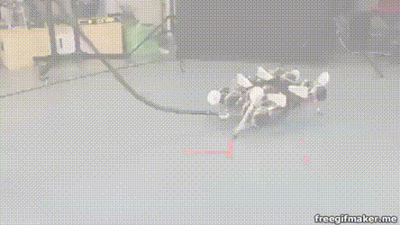

# Pyite

This module is a python implementation of  [IT&E](https://github.com/resibots/ite_v2).

Here are some IT&E use cases. You can click on the GIFs to watch the full videos.

## How to install ?

Dependencies (use pip or your favorite package manager)
- python3
- matplotlib
- pybullet
- numpy
- tensorflow
- gym

Clone this repository and run :

``git submodule update --init --recursive``

## Use with simulation

IT&E will be used with the maps contained in maps folter. The damages used here are defined in the pybullet_minitaur_sim and pyhexapod repositories.

To create new maps or change the damages please refer to the pybullet_minitaur_sim and pyhexapod repository.

You can disable the gui by modifying the params at the end of ite.py

####  For the minitaur

``python ite.py maps/minitaur/centroids_40000_16.dat maps/minitaur/archive_20000.dat 0 minitaur``

#### For the hexapod :

``python ite.py maps/hexapod/centroids_40000_6.dat maps/hexapod/archive_20000.dat 0 hexapod``

## Use with the real robot

#### For the minitaur

In order to run it with the real minitaur robot please refer to the [minitaur_framework](https://github.com/resibots/minitaur_framework.git)

Note that ite_maps.py has been configured to test 10 different maps from 10 different experiments
#### For the hexapod :

In order to run it with the real pexod robot, you will need to use the C++ API : [IT&E](https://github.com/resibots/ite_v2)
